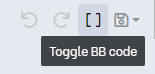
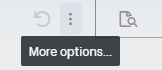
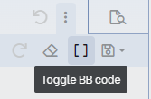

# Voz Keywords Filter
This is a script designed to remove URL tags and filter keywords on Vozforums.

## Why?
Filtering keywords on the forum can be quite frustrating. If your post contains certain words that match the forum's rules (such as "công an" or any words containing "BCA" like "webcache" or "webcam"), it will require approval before being visible. To address this issue, I created a filter script that aims to simplify the process.

## How it works?
The script reads the content from the clipboard, identifies keywords or regular expressions, and filters them out.

## How to use it?
Follow these steps to use the script:

1. Check for dependencies:
- Linux or MacOS users generally don't need any additional packages, as they work well with UTF8 encoding.
- Windows users, on the other hand, need to install pywin32.

2. Copy the BBcode
- Locate the "Toggle BB code" button on the editor toolbar.

  

- If necessary, click the "More options..." button to reveal it due to screen DPI.

  

  

- Copy the BBcode on the editor.

3. Run the remover.py script.

That's it! The script will remove the URL tags and filter the keywords for you. Now you can paste the filtered content into the forum's editor without worrying about being flagged.